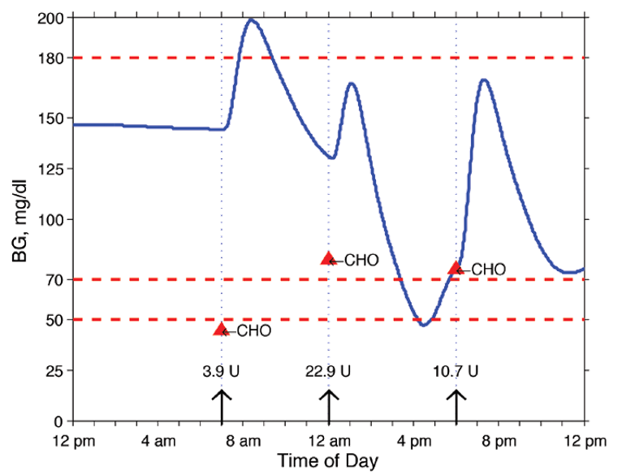

# VirtualPatients

<!-- ## 🔥 News

- [2024-12-25] Opensourced offline dataset
- [2024-01-26] Release VritualPatients V1.0 -->

VirtualPatients is a physics platform that enables users to design and test treatment protocols for in-silico subjects with Diabetes Mellitus. It is simultaneously multiple things:

1. A **lightweight**, **Pythonic**, and **user-friendly** patient simulation platform.
2.  A universal physics engine capable of simulating a wide range of individual differences and biophysiological phenomena.
3.  A tool to simulate and test treatment protocols identical to proposed clinical studies.
4.  A system to measure the impact on diabetes management and treatment.


## Key Features

- 🐍 100% Python, both front-end interface and back-end physics engine, all natively developed in python.
- 📐 Differentiability: VirtualPatients is designed to be fully compatible with differentiable simulation. 
- 💥 A unified framework that supports various state-of-the-art physics solvers, modeling a vast range of individual differences and biophysiological phenomena.

### IN SILICO POPULATION
- Embodies the biophysiological parameters of the FDA accepted in silico population
- 19 adults, 10 adolescents, 10 children

### BASIC USER-DEFINED SIMULATION INPUT
- Meal profiles (amount, timing and duration of a meal)
- Insulin treatment (amount and timing of basal/bolus insulin doses)
- Time of simulation and regulation (length & time of day)



### SUBJECT-SPECIFIC DATA TO FINE-TUNE TREATMENT
- Individualized, intra-personal results
- Inter-personal differences are revealed across the spectrum of human variation
- Population results are calculated from the individual results as in a clinical trial
- Age, Body Weight (kg), Subject-specific optimal basal insulin rate (u/hr), individual carbohydrate ratio (CR, g/U), total daily insulin, and insulin sensitivity (maximum drop in glucose mg/dl per unit of insulin[MD])
- Metabolic testing results may be simulated for individual subjects and incorporated into treatment plans prior

### SIMULATION RESULTS DATA (PER SUBJECT AND POPULATION) 
- Blood glucose (BG) values and simulated sensor readings (mg/dl per minute)
- Basal/bolus insulin injections (pmol/minute)
- User-specified data from controller
- System states, carbohydrate intake and more ...


## Differentiable Simulation Process


$$
\begin{aligned}
    & \Delta_0 = -\textcolor{myper}{k_{max}} \cdot x_0 + CHO \cdot 1000 \\
    & \textcolor{mygreen}{kgut} \in [\textcolor{myper}{k_{min}}, \textcolor{myper}{k_{max}}] \\
    & \Delta_1 = \textcolor{myper}{k_{max}} \cdot x_0 - \textcolor{mygreen}{kgut} \cdot x_1 \\
    & \Delta_2 = \textcolor{mygreen}{kgut} \cdot x_1 - \textcolor{myper}{kabs} \cdot x_2 \\
    & \Delta_3 = \max(\textcolor{myper}{kp_1} - \textcolor{myper}{kp_2} \cdot x_3 - \textcolor{myper}{kp_3} \cdot x_8, 0) - 1 +  \textcolor{myper}{\frac{f \cdot kabs}{BW}} \cdot x_2 \\
    & \quad - \textcolor{myper}{ke_1} \cdot \text{Relu}(x_3 - \textcolor{myper}{ke_2}) -  \textcolor{myper}{k_1} \cdot x_3 + \textcolor{myper}{k_2} \cdot x_4 \\
    & \Delta_4 = -\frac{\textcolor{myper}{Vm_0} + \textcolor{myper}{Vm_x} \cdot x_6 \cdot x_4}{x_4 + \textcolor{myper}{Km_0}} +  \textcolor{myper}{k_1} \cdot x_3 - \textcolor{myper}{k_2} \cdot x_4 \\
    & \Delta_5 = -\textcolor{myper}{m_2 + m_4} \cdot x_5 + \textcolor{myper}{m_1} \cdot x_9 +  \textcolor{myper}{ka_1} \cdot x_{10} + \textcolor{myper}{ka_2} \cdot x_{11} \\
    & \Delta_6 = -\textcolor{myper}{p2u} \cdot x_6 + \textcolor{myper}{p2u} \cdot \left( \frac{x_5}{\textcolor{myper}{Vi}} - \textcolor{myper}{Ib} \right) \\
    & \Delta_7 = - \textcolor{myper}{ki} \cdot \left( \frac{x_7 - x_5}{\textcolor{myper}{Vi}} \right) \\
    & \Delta_8 = - \textcolor{myper}{ki} \cdot (x_8 - x_7) \\
    & \Delta_9 = - \textcolor{myper}{m_1 + m_{30}} \cdot x_9 + \textcolor{myper}{m_2} \cdot x_5 \\
    & \Delta_{11} = \textcolor{myper}{kd} \cdot x_{10} - \textcolor{myper}{ka_2} \cdot x_{11} \\
    & \Delta_{12} = -\textcolor{myper}{ksc} \cdot x_{12} + \textcolor{myper}{ksc} \cdot x_3 \\
\end{aligned}
$$

<!-- ### Simulated Environment
VirtualPatients simulates the users' blood glucoses changes, under the intervene of meal size, insulin dosage, and exercise intensity. 

Utilizing the VirtualPatients simulator, one can access a "live" environment just like the real online healthcare environment. This simulator generates virtual patients individually, each beginning with an initial physiological metric, such as blood glucose levels. Algorithms are then tasked with formulating treatment recommendations, encompassing aspects like meal size, insulin dosage, and exercise intensity. Following the implementation of these treatments, the virtual patient provides feedback, indicating how their physiological metrics have responded, akin to the responses one would expect from real-life patients. This feedback loop simulates real-world patient responses, offering valuable insights into the effectiveness of treatment strategies.

1) We provide 30 virtual patients, modified from *the glucose-insulin system* [1], which is the open source part of the DMMS.R and T1DM simulators developed by The Epsilon Group and has been certified by the US FDA. The glucose-insulin system is an existing dynamic model of glucose ingestion and absorption, which is obtained through an extremely challenging triple tracer meal protocol by tracking the glucose conversion dynamic in the meals of 204 normal individuals. 

2) Besides, we provide 9 real-wrold patients trained through dataset from Dnurse. How these nine patients were trained is described in:

3) Each patient (both 30 virtual patients and 9 real-world patients) is associated with 61 static attributes. Here, static/dynmaic means whether the features will change during an interactive process. The attributes information about involve patient age, patient gender, patient , etc.

4) We provide  -->

## How to Use VirtualPatients?
### Quick Installation
For the latest version, clone the repository and install locally:
```bash
git clone https://github.com/yuxuehui/VirtualPatient.git
cd VirtualPatients
pip install -e .
```

## Usage for Supervised Learning

## Usage for Reinforcement Learning

How to instantiate a virtual patient?
```python
from virtual_patient.envs.env_do_all_her_2reward import CBNEnv
from stable_baselines3 import PPO
env = CBNEnv.create(
        info_phase_length=1440,
        action_range=args.action_range,
        vertex=args.vertex,
        # reward_weight=args.reward_weight,
        reward_scale=args.reward_scale,
        n_env=1,
        patient_ID=args.patient_ID,
        list_last_vertex=[],
        flag=0,
        meal_time=[300,600,1000],
        default_meal=[50,100,100],
        default_insulin=0.02
    )
optimizer_kwargs = dict(
        alpha=0.95,
    )
policy_kwargs = dict(
        optimizer_kwargs=optimizer_kwargs,
        optimizer_class=RMSpropTFLike
    )
model = PPO("MlpPolicy",
            env,
            n_steps=5,
            gae_lambda=0.95,
            gamma=0.9,
            n_epochs=10,
            ent_coef=0.0,
            learning_rate=float(1e-4),
            clip_range=0.2,
            use_sde=True,
            sde_sample_freq=4,
            verbose=1,
            tensorboard_log='../logs',
            seed=94566)
model.learn(
    total_timesteps=int(3e7),
    callback=TensorboardCallback())

env.close()
```

个性化说明：
一共三种模式：只控制碳水，只控制胰岛素，同时控制碳水与胰岛素。
个性化一共需要设置env = CBNEnv.create中的五个参数：info_phase_length,flag,meal_time,default_meal,default_insulin
下面对参数进行说明：
flag：取值为0/1/2，设置控制模式。0只控制碳水，1只控制胰岛素，2同时控制碳水与胰岛素。
info_phase_length：训练步长，flag=1时需要设置为2，其余设置为1440。
meal_time:用餐时间，格式为拥有3个元素的列表，单位为min，默认值为360,660,1080。eg：[360,660,1080]
default_meal：用餐量，用于在flag=0时控制默认的用餐量，格式为拥有3个元素的列表，默认值为50,50,50。eg：[50,50,50]
default_insulin:胰岛素量，用于在flag=1时控制默认的胰岛素输入量，格式为float，默认值0.01
**另外需要根据模式不同改变parser.add_argument("-action_range", nargs='+', type=int, help=" ",default=[0,300])中的参数，用来指定动作空间取值范围**


## Acknowledgement
This project is an outcome of a joint work of [Web Intelligence Group](http://wi.hit.edu.cn/), Harbin Insititute Technology and [Dnurse: Prescription Digital Therapeutics Companies](https://www.dnurse.com/v2/en/).

# Reference
[1] Dalla Man C, Rizza R A, Cobelli C. Meal simulation model of the glucose-insulin system[J]. IEEE Transactions on biomedical engineering, 2007, 54(10): 1740-1749.